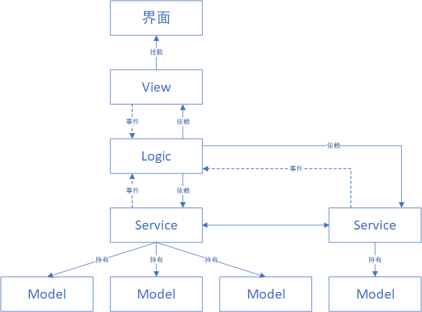

# LitMVC
A lightweight MVC framework for Unity  
Designed for rapid development of UI systems in small to medium-sized projects.  
This branch is for the path generation solution. For the binding solution, please switch to the `bindingSolution` branch.

## Usage
Place the `LitMVC` directory directly into your project. This project only implements the MVC part. If you want to use it in your project, please:

- Build the data model loading part yourself and create scripts in the `Model` directory to hold it.
- Build the management and control part of the `UIManager` yourself to better fit your project.

Example: https://github.com/DemiseTwilight/LitMVCExample.git

## Structure

### Interface
A Unity prefab that can be placed anywhere. Child nodes with `_` in their names can be recognized by the tool, which will automatically generate code and bind them.

### View
Scripts for binding the interface, generated by the tool and automatically bound to the prefab. Each time the tool is called, it regenerates the scripts. Inherits from `UIView`.

### Logic
Scripts for interface logic, generated by the tool but not refreshed after generation. Write your logic code here. Inherits from `UIView` and can use features provided by `MonoBehaviour`.
Logic scripts depend on the `Service` layer and receive events. Avoid coupling between `Logic` scripts; use an event system or `Service` as a mediator for communication.

### Service
Business logic scripts. It is recommended to use the singleton pattern and respond to `Logic` via events to reduce coupling. If multiple implementations are needed, consider adding an interface layer for decoupling.
These scripts hold data and can depend on other `Service` scripts.

### Model
The data layer. It is recommended to use the singleton pattern to hold and load data. `dataModel` can be placed anywhere, and you need to write the loading logic yourself.

## Tools
Click the `CreateUIView` option on the prefab to automatically generate `View` and `Logic` scripts.  
If there are path errors, try clicking the "Auto Fill" button in the `Config` file.